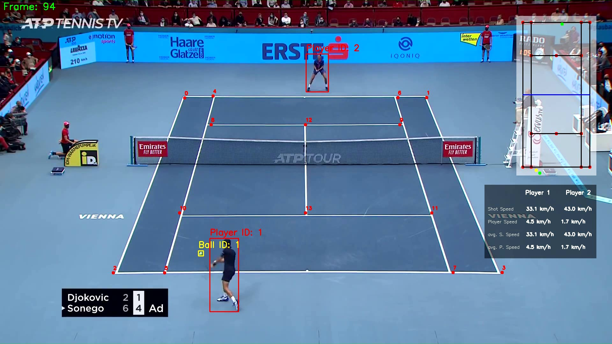

# Tennis Analysis

## Introduction
This project analyzes professional tennis matches to measure player speed, ball shot speed, and the number of shots exchanged. It detects players and the tennis ball using YOLO, and utilizes a ResNet-50-based model to extract court keypoints. This project provides a practical framework for real-time sports analytics by combining object detection, motion tracking, and court geometry estimation, making it suitable for building advanced video analysis tools in sports.

## Output Visualization
The system generates annotated match footage like the screenshot below, showcasing:

- Real-time player tracking (Player ID: 1 and 2)
- Ball tracking (Ball ID: 1)
- Court keypoints mapped for geometric calibration
- Shot and player speed for both players
- Scoreboard overlay for context

  
*Frame 94: Player 1 (Djokovic) prepares a return while Player 2 (Sonego) is positioned at the baseline.*

**Mini Court Overlay Legend:**
- 🔴 **Red dots**: Detected court keypoints  
- 🔵 **Blue line**: Tennis net  
- 🟢 **Green dots**: Player positions  
- 🟡 **Yellow dot**: Ball position

**Example metrics shown:**
- **Shot Speed**: Player 1 – 33.1 km/h, Player 2 – 43.0 km/h  
- **Player Speed**: Player 1 – 4.5 km/h, Player 2 – 1.7 km/h  
- **Average Shot Speed**: Same as above  
- **Average Player Speed**: Same as above

## Models Used
- **YOLOv8** – For real-time player detection
- **Fine-tuned YOLO** – Specialized for detecting tennis balls  
- **ResNet-50 (PyTorch)** – For tennis court keypoint detection and mapping

## Dataset
- The tennis ball detection model was trained using a public dataset from Roboflow:  
  👉 [Tennis Ball Detection Dataset – Roboflow](https://universe.roboflow.com/viren-dhanwani/tennis-ball-detection)

## Training
You can find training notebooks in the `training/` directory:
- `tennis_ball_detector_training.ipynb` – For training the ball detection model
- `tennis_court_keypoints_training.ipynb` – For training the court keypoint detection model using ResNet-50

## Requirements
Make sure to install the following dependencies before running the project:

```bash
pip install ultralytics torch opencv-python pandas numpy
```

Compatible with:
- Python 3.8+

## Usage
To run the project, navigate to the project directory and execute the main script:

```bash
cd TennisAnalysis
python main.py
```

Make sure your input video and configuration files (if any) are placed as expected by `main.py`.

## Acknowledgements
- **Roboflow** for the open tennis ball dataset
- **Ultralytics** for YOLOv8 implementation
- **PyTorch** for model training and inference
